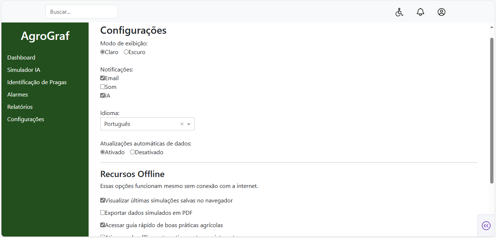
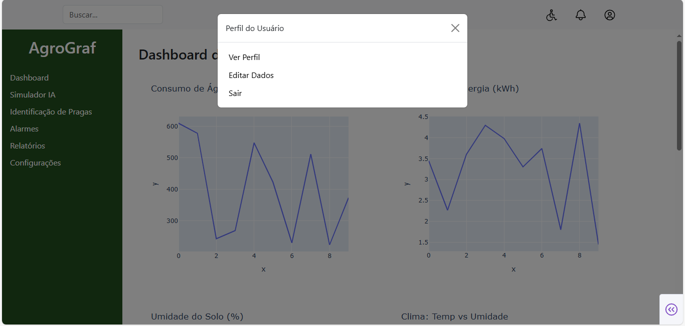

# AgroGraf MVP

Desenvolvimento do sistema web (frontend e backend) por: **Ana Beatriz Silva Araujo**

Este é o MVP do **AgroGraf**, uma plataforma inteligente de monitoramento agrícola desenvolvida com Python, Dash e Plotly. O sistema foi pensado para ser educativo e funcional, mesmo sem o uso das ferramentas Google Cloud que estavam previstas inicialmente.

## Contribuição pelos integrantes da equipe

Este projeto também contou com a colaboração de:

- **Alex Sandro Vulf** – Elaboração do pitch em vídeo
- **Brenda Abreu Almeida** – Elaboração da apresentação
- **Ricardo Cristiano da Silva** - Elaboração da documentação técnica

## Funcionalidades

###  Dashboard

Exibe gráficos sobre energia, umidade, temperatura, entre outros indicadores de lavoura.

###  Simulador com IA

Permite simular cenários agrícolas com base em clima e tipo de cultura. Planejado para futura integração com Vertex AI.

###  Notificações

Alertas sobre mudanças ambientais, irrigação e eventos críticos na plantação.

###  Alarmes

Sistema de alarme simulado para incêndios, alagamentos e eventos extremos.

###  Identificação de Pragas

Usuários podem enviar imagens de folhas/plantações para futura detecção de pragas e doenças via IA.

###  Relatórios

Seção para visualização e exportação futura de dados.

###  Configurações

Espaço reservado para preferências e ajustes da plataforma.

###  Acessibilidade

Botão de acessibilidade com opções ajustáveis, incluindo compatibilidade futura com diferentes deficiências.

###  Usuário

Perfil e configurações de conta.

---

## Como executar pela primeira vez 

1. No terminal da IDE, crie um ambiente virtual:

- Windows:
```bash
python -m venv venv
```

- Linux:
```bash
python3 -m venv venv
```

2. Ative o ambiente:

- Windows:
```bash
venv\Scripts\activate
```

- Linux:
```bash
source venv/bin/activate
```

3. Instale as dependências:

- Windows/Linux:
```bash
pip install -r requirements.txt
```

4. Execute o projeto:

- Windows:
```bash
python app.py
```

- Linux:
```bash
python3 app.py
```

## Como executar pela segunda vez 
---
No VSCode:
1. Abra o terminal e ative o ambiente:

- Windows:
```bash
venv\Scripts\activate
```

- Linux:
```bash
source venv/bin/activate
```

2. Execute o projeto:

- Windows:
```bash
python app.py
```

- Linux:
```bash
python3 app.py
```

## Requisitos

- Python 3.10+
- Dash, Plotly, Dash Bootstrap Components
- Sensores BitDogLab (Raspberry Pi Pico W)
- (Futuramente) Integração com Google Cloud, Vertex AI, Firebase e BigQuery 
      
# AgroGraf - Sistema de Monitoramento Agrícola (Módulo Embarcado)

Módulo Embarcado desenvolvido por: **Ricardo Cristiano da Silva**

AgroGraf é um sistema embarcado projetado para a placa BitDogLab (utilizando Raspberry Pi Pico W) para simular o monitoramento e gerenciamento de setores agrícolas. Ele utiliza uma matriz de LEDs WS2812B para visualização de status, um joystick para navegação e interação, um display OLED para informações, um buzzer para alertas, e um servidor HTTP para monitoramento e controle remoto via Wi-Fi.

## Funcionalidades Principais

*   **Visualização de Setores:** Matriz de LEDs 5x5 (25 setores) exibe o status de cada setor:
    *   **Apagado:** Setor não cadastrado.
    *   **Verde:** Setor cadastrado, temperatura normal.
    *   **Vermelho:** Setor cadastrado, temperatura em alerta (>100°C).
    *   **Azul:** Cursor para navegação no modo de cadastro.
*   **Gerenciamento de Setores:**
    *   Cadastro e descadastro de setores usando joystick e botões A/B.
    *   Atribuição de nomes padrão aos setores (ex: "Setor (1,1)").
    *   Simulação e alteração de temperatura para cada setor cadastrado.
*   **Interface de Usuário:**
    *   Menu interativo via console serial (USB).
    *   Display OLED SSD1306 para mensagens de boas-vindas e status (potencial para mais informações).
*   **Alertas:**
    *   Buzzer sonoro ativado quando a temperatura de qualquer setor cadastrado excede 100°C.
    *   Indicação visual (LED vermelho) para setores em alerta.
*   **Sensor de Temperatura:** Leitura da temperatura ambiente através do sensor interno do RP2040.
*   **Conectividade Wi-Fi:**
    *   Conecta-se a uma rede Wi-Fi especificada.
    *   Exibe o endereço IP no console serial após conexão bem-sucedida.
*   **Servidor HTTP:**
    *   Página web acessível via navegador para:
        *   Visualizar o status de todos os setores cadastrados e suas temperaturas.
        *   Visualizar o estado do buzzer (ATIVO/DESATIVADO).
        *   Acionar remotamente os "equipamentos contra incêndio" (reseta temperaturas altas).
        *   Limpar remotamente o sistema (reseta todos os setores e LEDs).
    *   A página se auto-atualiza a cada 5 segundos.

## Hardware Necessário

*   Placa BitDogLab ou Raspberry Pi Pico W.
*   Matriz de LEDs WS2812B 5x5 (25 LEDs).
*   Joystick analógico com botão de pressão.
*   Display OLED SSD1306 (comunicação I2C).
*   Buzzer passivo.
*   Botão A (push-button).
*   Botão B (push-button).
*   Cabos/Jumpers para conexões.
*   Fonte de alimentação adequada (especialmente se muitos LEDs estiverem em brilho máximo).

## Pinagem (Conexões no Raspberry Pi Pico W)

| Componente        | Pino no Pico W | GPIO Lógico | Função                     |
| :---------------- | :------------- | :---------- | :------------------------- |
| Matriz LEDs (DIN) | GP7            | 7           | WS2812B Data               |
| Joystick Eixo X   | ADC1 (GP27)    | 27          | Leitura Analógica X        |
| Joystick Eixo Y   | ADC0 (GP26)    | 26          | Leitura Analógica Y        |
| Botão Joystick    | GP22           | 22          | Entrada Digital (Pull-up)  |
| Botão A           | GP5            | 5           | Entrada Digital (Pull-up)  |
| Botão B           | GP6            | 6           | Entrada Digital (Pull-up)  |
| OLED SDA          | GP14 (I2C1 SDA)| 14          | I2C Data                   |
| OLED SCL          | GP15 (I2C1 SCL)| 15          | I2C Clock                  |
| Buzzer            | GP21           | 21          | Saída PWM                  |
| Sensor Temp. Pico | ADC4           | (Interno)   | Leitura Temp. Onboard RP2040|

*Nota: Lembre-se de conectar VCC (3.3V ou 5V, conforme o componente) e GND para todos os componentes. A matriz de LEDs WS2812B geralmente requer 5V para alimentação e dados, mas o sinal de dados do Pico (3.3V) costuma ser suficiente.*

## Software e Dependências

*   Raspberry Pi Pico SDK (testado com v1.5.1)
*   CMake (versão 3.13 ou superior)
*   ARM GCC Toolchain (ex: `arm-none-eabi-gcc`)
*   `ws2818b.pio` (arquivo de programa PIO para os LEDs WS2812B, incluído no projeto)
*   Biblioteca SSD1306 (arquivos `inc/ssd1306.h` e `inc/ssd1306_i2c.c`, incluídos no projeto)

## Configuração do Wi-fi

As credenciais da rede Wi-Fi (SSID e senha) estão definidas diretamente no arquivo `agrograf.c`:

```c
#define WIFI_SSID "SSID"
#define WIFI_PASS "password"
```

---

## Sobre o Projeto

Este projeto foi desenvolvido para a Hackathon Google Cloud com foco em **agricultura sustentável inteligente**, utilizando tecnologias como **IA, Cloud Computing e IoT**.
